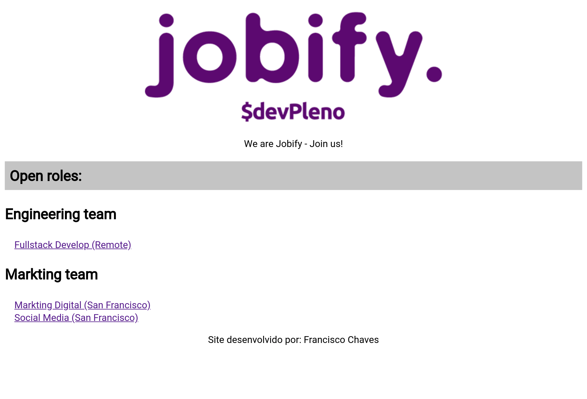

# :tada: JOBIFY :tada:

Jobify is a simple job board for sites - Developed during the FullStack Lab 2 of [DevPleno](https://www.devpleno.com).

## Screenshot :camera:



## Pré-requisitos :computer:

[NodeJS](https://nodejs.org/en/)

## Settings :wrench:

Clone the project:
```bash
git clone https://github.com/franciscojsc/jobify.git
```

Enter the folder:
```bash
cd jobify
```

## Deployment :rocket:

Install the dependencies:
```bash
npm install
```

Launch the application:
```bash
npm start
```

Access the application at `http://localhost:3000`.